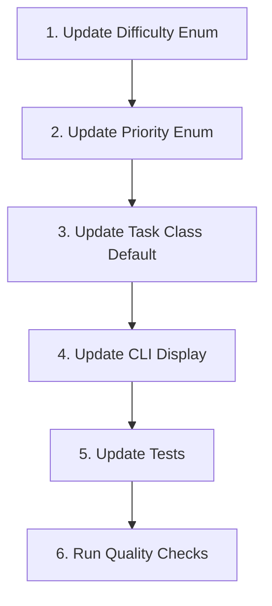

# Detailed Plan: Add Emoji and Display Style to Difficulty Field

Based on your requirements, here's a detailed plan to implement the changes to the Difficulty field:

## 1. Update the Difficulty Enum in models.py

- Remove the NOT_SET option
- Add emoji() and display_style() methods similar to Priority
- Use the specified emojis:
  - TRIVIAL: 🍭 (lollipop)
  - LOW: 🪶 (feather)
  - MEDIUM: 🧱 (brick)
  - HIGH: 🧗 (person climbing)
  - HERCULEAN: 🦾 (mechanical arm)
- Use the same color scheme as Priority

## 2. Update the Priority Enum

- Change the TRIVIAL display style to use "teal" instead of no color (for both Priority and Difficulty)

## 3. Update the Task Class

- Change the default value for the difficulty field from NOT_SET to TRIVIAL

## 4. Update the CLI Display

- Update the list view (handle_list) to display difficulty alongside priority
- Ensure the view handler (handle_view) properly displays difficulty with emoji and style

## 5. Update Tests

- Update test_models.py to test the new emoji() and display_style() methods for Difficulty
- Update tests for Task initialization to reflect the new default value
- Update any other tests that might be affected by these changes

## 6. Run Quality Checks

- Run `poetry run poe check` to ensure all linting, type checking, and tests pass

## Implementation Flow Diagram



## Code Changes

### 1. models.py Changes

```python
# Update Difficulty enum
class Difficulty(str, Enum):
    """Difficulty levels for tasks."""

    TRIVIAL = "Trivial"
    LOW = "Low"
    MEDIUM = "Medium"
    HIGH = "High"
    HERCULEAN = "Herculean"

    def emoji(self) -> str:
        """Returns emoji representation of the difficulty level."""
        if self == Difficulty.TRIVIAL:
            return "🍭"  # Lollipop
        elif self == Difficulty.LOW:
            return "🪶"  # Feather
        elif self == Difficulty.MEDIUM:
            return "🧱"  # Brick
        elif self == Difficulty.HIGH:
            return "🧗"  # Person climbing
        elif self == Difficulty.HERCULEAN:
            return "🦾"  # Mechanical arm
        else:
            return ""  # Fallback # pragma: no cover

    def display_style(self) -> str:
        """Returns rich console style string for the difficulty."""
        if self == Difficulty.TRIVIAL:
            return "teal"
        elif self == Difficulty.LOW:
            return "green"
        elif self == Difficulty.MEDIUM:
            return "yellow"
        elif self == Difficulty.HIGH:
            return "orange1"
        elif self == Difficulty.HERCULEAN:
            return "red"
        else:
            return ""  # Fallback # pragma: no cover

# Update Priority.TRIVIAL display_style to use "teal"
# In Priority.display_style method:
if self == Priority.TRIVIAL:
    return "teal"  # Changed from "" to "teal"

# Update Task class default for difficulty
difficulty: Difficulty = field(default=Difficulty.TRIVIAL)  # Changed from NOT_SET to TRIVIAL
```

### 2. main.py Changes

```python
# Update handle_list to display difficulty
for task in user.tasks:
    priority_text = f"{task.priority.emoji()} {task.priority.value}"
    difficulty_text = f"{task.difficulty.emoji()} {task.difficulty.value}"
    table.add_row(task.id[:8], priority_text, difficulty_text, task.description)

# Update handle_view to display difficulty with emoji and style
difficulty_text = Text()
difficulty_text.append(f"{task.difficulty.emoji()} ")
difficulty_text.append(task.difficulty.value, style=task.difficulty.display_style())
table.add_row("Difficulty:", difficulty_text)
```

### 3. Test Updates

```python
# Add tests for Difficulty emoji and display_style
def test_difficulty_emoji() -> None:
    """Test that each difficulty level returns the correct emoji."""
    assert Difficulty.TRIVIAL.emoji() == "🍭"  # Lollipop
    assert Difficulty.LOW.emoji() == "🪶"  # Feather
    assert Difficulty.MEDIUM.emoji() == "🧱"  # Brick
    assert Difficulty.HIGH.emoji() == "🧗"  # Person climbing
    assert Difficulty.HERCULEAN.emoji() == "🦾"  # Mechanical arm

def test_difficulty_display_style() -> None:
    """Test that each difficulty level returns the correct display style for rich."""
    assert Difficulty.TRIVIAL.display_style() == "teal"
    assert Difficulty.LOW.display_style() == "green"
    assert Difficulty.MEDIUM.display_style() == "yellow"
    assert Difficulty.HIGH.display_style() == "orange1"
    assert Difficulty.HERCULEAN.display_style() == "red"

# Update test_task_initialization to check for TRIVIAL default
def test_task_initialization() -> None:
    # ...existing code...
    # Check default difficulty
    assert task.difficulty == Difficulty.TRIVIAL  # Changed from NOT_SET to TRIVIAL